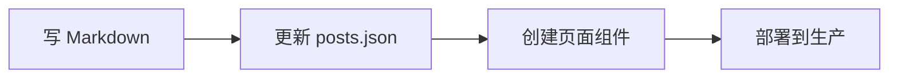

# 内容管理指南 📝

## 内容文件结构

```
/public/content/
├── posts.json           # 所有文章的元数据
├── claude-code-guide-zh.md
├── claude-code-guide.md
└── [新文章文件].md
```

## 添加新文章的步骤

### 1. 创建 Markdown 文件
在 `/public/content/` 目录下创建你的 markdown 文件：
- 中文版：`your-article-zh.md`
- 英文版：`your-article-en.md`

### 2. 更新 posts.json
在 `posts.json` 中添加新文章的元数据：

```json
{
  "id": "your-article-id",
  "slug": "your-article-slug",  // URL路径
  "category": "guide",           // 分类：guide, tutorial, announcement, update
  "featured": false,             // 是否推荐
  "publishedAt": "2025-09-23",
  "updatedAt": "2025-09-23",
  "author": "作者名",
  "readingTime": 10,             // 预计阅读时间（分钟）
  "tags": ["标签1", "标签2"],
  "locales": {
    "zh": {
      "title": "文章标题",
      "description": "文章描述",
      "summary": "文章摘要",
      "contentFile": "your-article-zh.md"
    },
    "en": {
      "title": "Article Title",
      "description": "Article description",
      "summary": "Article summary",
      "contentFile": "your-article-en.md"
    }
  }
}
```

### 3. 创建页面文件
在 `/pages/posts/` 下创建 `[your-article-slug].js`：

```javascript
import { useTranslation } from 'next-i18next'
import { serverSideTranslations } from 'next-i18next/serverSideTranslations'
import MarkdownPost from '../../components/MarkdownPost'
import fs from 'fs'
import path from 'path'
import postsData from '../../public/content/posts.json'

const YourArticlePage = ({ markdownContent, postMeta }) => {
  const { t, i18n } = useTranslation('common')
  const currentLocale = i18n.language
  const localeMeta = postMeta.locales[currentLocale]

  return (
    <MarkdownPost
      content={markdownContent}
      title={localeMeta.title}
      author={postMeta.author}
      date={postMeta.publishedAt}
      readingTime={postMeta.readingTime}
    />
  )
}

export async function getStaticProps({ locale }) {
  const post = postsData.posts.find(p => p.slug === 'your-article-slug')
  const contentFile = post.locales[locale].contentFile
  const filePath = path.join(process.cwd(), 'public', 'content', contentFile)
  const markdownContent = fs.readFileSync(filePath, 'utf8')

  return {
    props: {
      ...(await serverSideTranslations(locale, ['common'])),
      markdownContent,
      postMeta: post
    }
  }
}

export default YourArticlePage
```

### 4. 更新 Billboard 页面
Billboard 页面会自动从 `posts.json` 读取并显示新文章。

## 内容工作流程



## 最佳实践

1. **命名规范**：
   - Markdown 文件：`article-name-{locale}.md`
   - 页面文件：`article-slug.js`
   - ID/Slug：使用小写和连字符

2. **内容组织**：
   - 将相关图片放在 `/public/images/posts/[article-slug]/`
   - 保持中英文内容同步更新

3. **版本控制**：
   - 每次更新内容时更新 `updatedAt` 字段
   - 在 commit message 中说明内容更新

## 未来优化方向

1. **内容 API**：创建 API 端点动态加载内容
2. **MDX 支持**：支持在 Markdown 中使用 React 组件
3. **CMS 集成**：集成 Strapi 或 Contentful 等 CMS
4. **自动化**：创建脚本自动生成页面文件